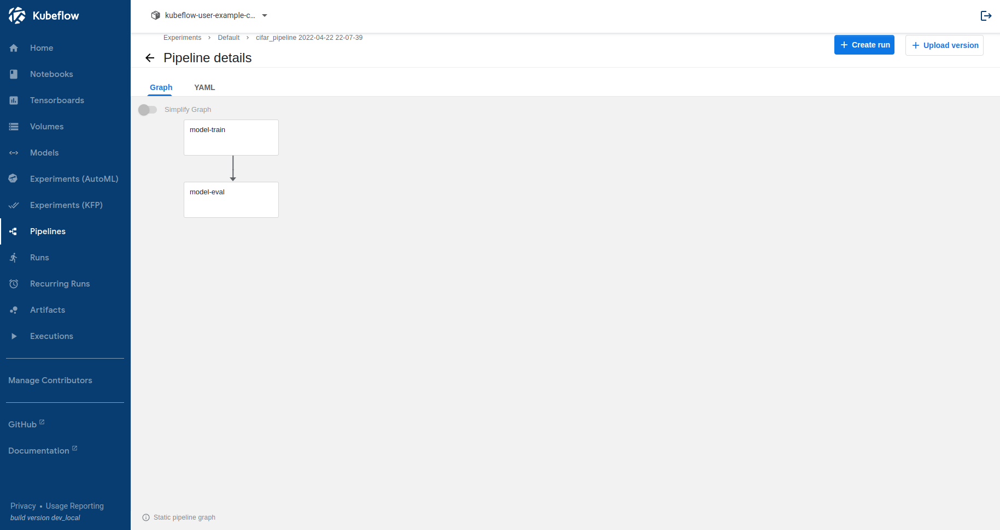
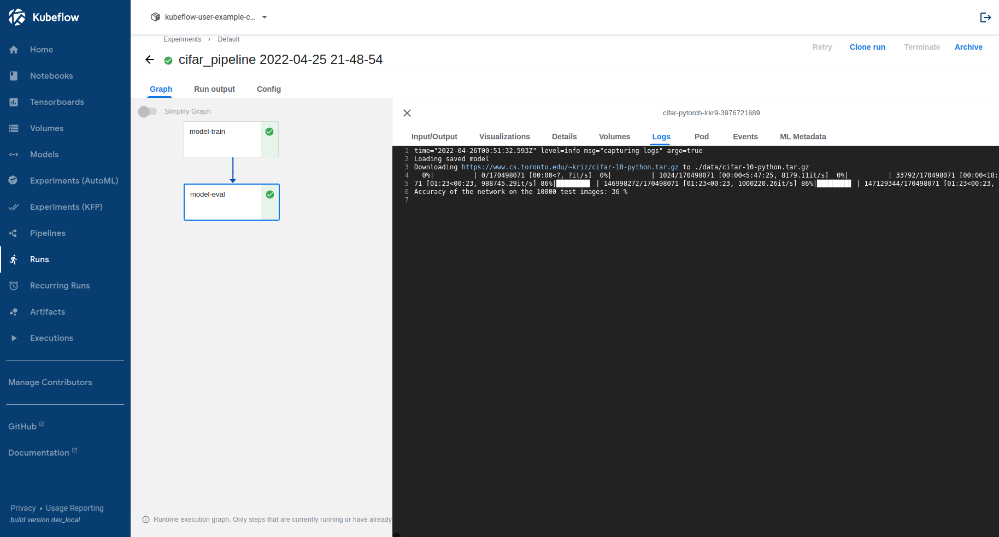

# Pytorch on kubeflow pipelines

This repo is a [PyTorch CIFAR10 tutorial](https://pytorch.org/tutorials/beginner/blitz/cifar10_tutorial.html) implementation using python scripts to run on kubeflow pipelines.

## Motivations
Running ML code on jupyter notebooks is good for quick prototyping and model exploration. On production level large scale model training settings we should prefer `.py` ML pipelines packed into a docker image running on kubernetes for reproducible, scalable and mainteinable workloads. The main reasons are:

* Python code is easyer to review and maintain.
* Python scripts allow automation of end-to-end executions using a few commands.
* Docker images packs OS and dependencies so the train run roughly the same everywhere.
* Dividing the execution into smaller steps allows more control over the runtime environment and infrastructure.
* Running the training pipeline over kubernetes facilitates using on demand jobs with custom CPU, RAM and GPU.

## Goals

In this example we will build a two step pipeline consisting of a training step followed by an evaluation step.



Although the example is quite simple, the code structure is very robust and can be reused for heavyer and more complex pipelines.

## Prerequisites

**Development**
* Docker
* [kfp SDK](https://pypi.org/project/kfp/) 1.x

**Server**
* Any Docker Container Registry (e.g. dockerhub, acr, gcr)
* A running kubeflow cluster.

This tutorial was designed to run using a local kubeflow cluster installed using [kubeflow manifests](https://github.com/kubeflow/manifests#installation). Specifically, we use the module `helpers/kfp_auth` to authenticate kfp requests to Pipelines API through DEX. Minor modifications are required to use other authentication schemes.

## Running the samples

Build the docker image and push to container registry.

```
docker build -t <container registry URI + tag>:latest . && \
docker push <container registry URI + tag>:latest
```

Deploy the pipeline to kubeflow.

```
# Install kfp
pip install --upgrade kfp

# Export authentication ENVs
export $(cat sample.env | xargs)

# Deploy pipeline
python pipeline.py
```

Open your kubeflow pipelines to check status and logs.



Alternatively, use the kubeflow SDK to fetch data programatically:

```python
from helpers.kfp_auth import KfpAuth
client = KfpAuth().client()
experiment_id = client.get_experiment(experiment_name='Default').id
print(f'Experiment id: {experiment_id}')
runs = client.list_runs(experiment_id=experiment_id, sort_by='created_at desc')
print(f'Latest run {runs.runs[0].id} has status {runs.runs[0].status}')
```
